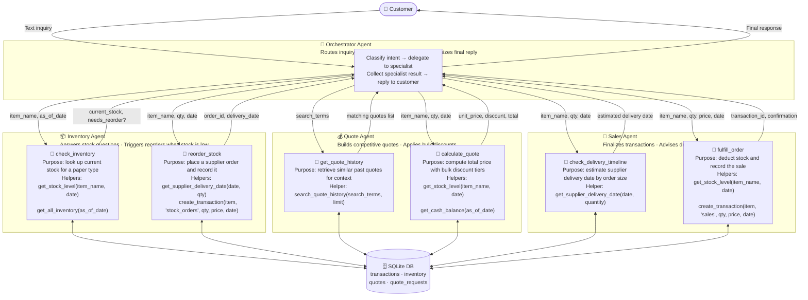

# Beaver's Choice Paper Company — Inventory & Quoting Agent System

A multi-agent AI system built to streamline inventory management, quote generation, and sales transactions for the Beaver's Choice Paper Company.

## Overview

The Beaver's Choice Paper Company was losing potential sales due to slow, manual processes for handling customer inquiries, checking inventory, and generating quotes. This project delivers a multi-agent solution (at most five agents) that automates these workflows end-to-end using Python and the `smolagents` framework.

## What the System Does

The agents work together to:

- **Inventory Management** — Answer questions about current stock levels and automatically reorder supplies when inventory falls below threshold, using a `sqlite3` database as the source of truth.
- **Quote Generation** — Produce accurate, competitive quotes for customers by consulting historical quote data and applying appropriate pricing strategies.
- **Sales Transactions** — Finalize sales based on available inventory and estimated delivery timelines.

## Agent Workflow



## Project Structure

TODO

## Tech Stack

| Component | Choice |
|---|---|
| Language | Python 3.12+ |
| Agent Framework | `smolagents` |
| Database | `sqlite3` (built-in) |
| Input / Output | Text-based only |

## Deliverables

- [ ] Workflow diagram (image file) showing the multi-agent architecture
- [ ] `main.py` — complete multi-agent implementation
- [ ] This README / project documentation

## Project Steps

1. **Diagramming & Planning** — Design the agent workflow and interaction diagram.
2. **Implementation** — Build the multi-agent system in `main.py`.
3. **Testing & Debugging** — Validate all agents against the provided sample requests.
4. **Documentation** — Describe design decisions and how requirements are satisfied.

## Getting Started

```bash
TODO
```
