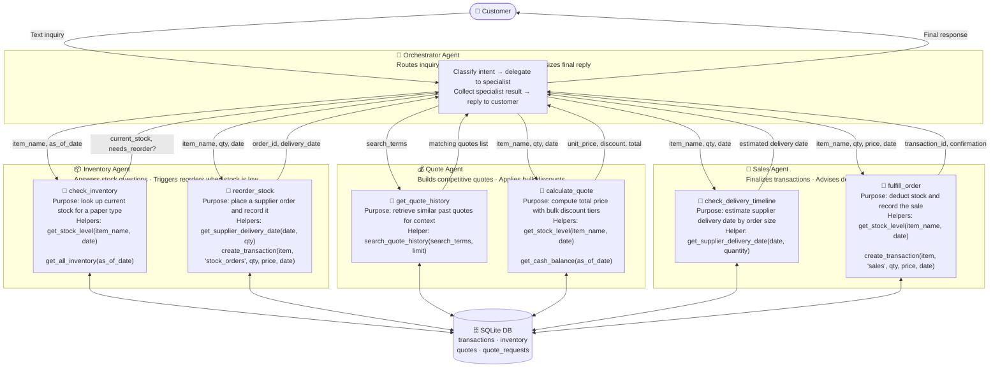
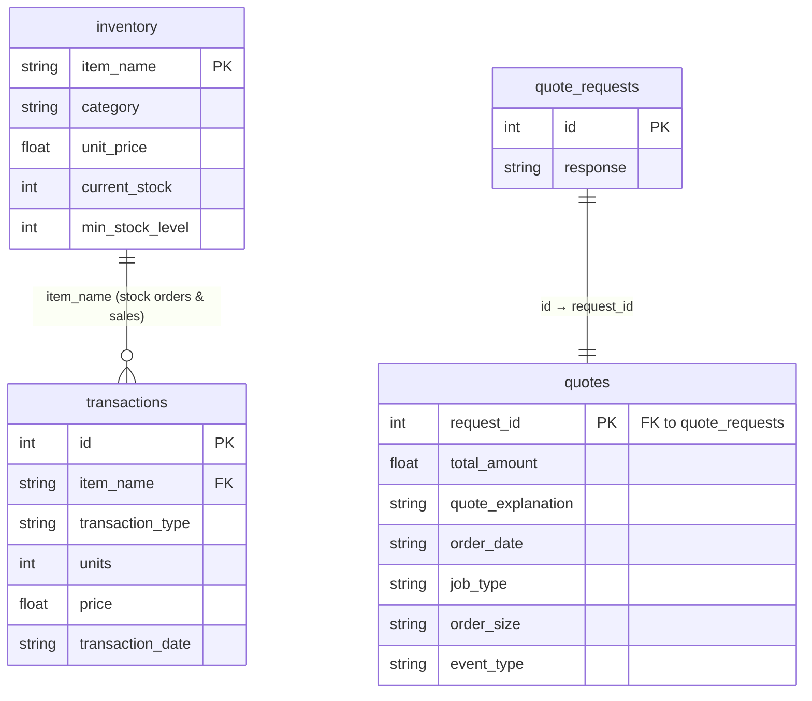

# Reflection Report

## Agent workflow & Diagram

The current setup has four agents in total. We have an `Orchestrator` which is the main brain of the system. Main job is to figure out what the potential customer is after and to correctly route to the most qualified sub agent that could complete the task. Once the sub agent completes their task, the Orchestrator compiles and formulates a proper response. Since I am using smolagents, the Orchestrator is a toolcalling agents that has no tools but maintains a list of managed agents. The other agents are as follows, the `InventoryAgent`, `QuoteAgent` and `SalesAgent`. Inventory agent has tools to check the inventory and if necessary, restock. The Quote agent, can look up previous quote history and generate new quotes. This includes handling discounts. Finally the Sales agent is tasked with checking delivery timeline and making the sale. At a highlevel this is a very basic setup. The system maintains all the records in SQLite. The diagram below shows the tables and relations.

## Eval Results Discussion

## Future Improvements